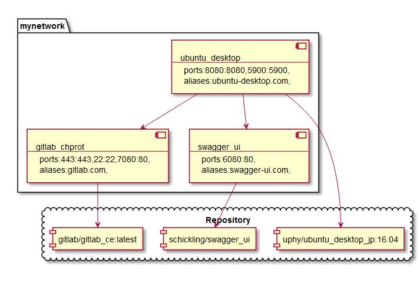

# docker-uml-converter
Convert docker-compose.yml to plantuml with atom:markdown-preview-enhanced using python

## Purpose
- Simplicity
  - Easy to develop
- Flexibility
  - Function based microservices
    - Porting to serverless systems


## Supported service settings
Must define service settings below in docker-compose.yml
- Correspondence table

| Docker-compose v3 | Plantuml component diagram      |
|:------------------|:--------------------------------|
| services          | components                      |
| depends_on        | links                           |
| networks          | package                         |
| image             | component in cloud              |
| ports             | ports properties in component   |
| aliases           | aliases properties in component |


## Attentions
Convert below to allowed
| Docker-compose v3 | Plantuml component diagram |
|:----------------- |:-------------------------- |
| "-"               | "_"                        |


## Install requirements
- Ubuntu 16.04
```
$ apt-get update && \
  apt-get install -y atom && \
  apm install markdown-preview-enhanced && \
  apt-get install -y plantuml && \
  apt-get install python-pip && \
  pip install pyyaml
```

## Usage
- Command
```
$ python dc2uml.py fullpath/inputfile.yml fullpath/outputfile.md
```


## Examples
- See an [examples](examples) folder


## Future works
- Refactoring
  - Redefine Meta processes
  - Repeated strings to outside
  - No dependency on requirements version
- Support
  - Exception cases
  - Other service settings
  - Dockerfile
  - Other plantuml diagrams
  - Other text-based uml tools
  - Official plantuml format
  - Redefine correspondence
- Monolithic to microservices


## Related works
- compose_plantuml
  - https://github.com/funkwerk/compose_plantuml

## License
MIT
